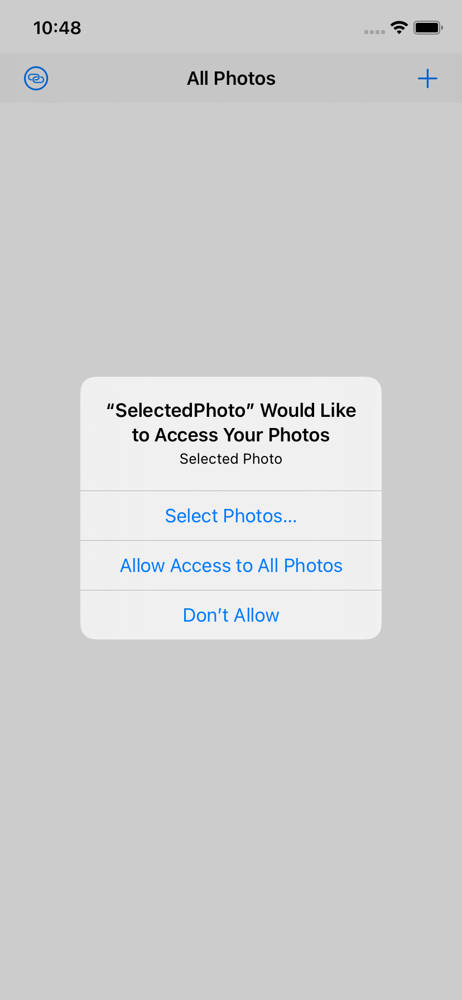
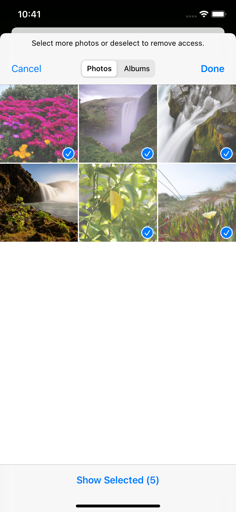
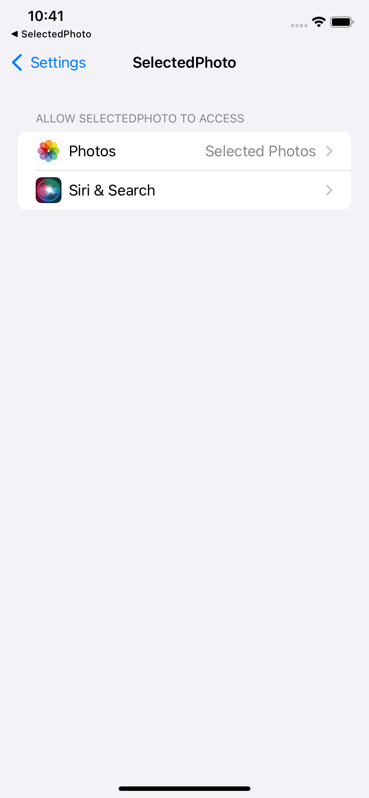

# SelectedPhoto

A modern iOS application that allows users to browse and select photos from their photo library with a clean and intuitive interface.

현대적인 iOS 애플리케이션으로, 사용자가 사진 라이브러리에서 사진을 탐색하고 선택할 수 있는 깔끔하고 직관적인 인터페이스를 제공합니다.

## Features / 기능

- 📸 Photo Library Access: Seamlessly access and display photos from the device's photo library
  사진 라이브러리 접근: 기기의 사진 라이브러리에서 사진을 쉽게 접근하고 표시
- 🖼️ Grid View: Photos are displayed in a responsive 3-column grid layout
  그리드 뷰: 반응형 3열 그리드 레이아웃으로 사진을 표시
- 🔒 Privacy-Focused: Implements proper photo library authorization handling
  개인정보 보호: 적절한 사진 라이브러리 권한 처리 구현
- 🎯 Photo Selection: Built-in support for selecting and managing photos
  사진 선택: 사진 선택 및 관리 기능 내장
- 🎨 High-Quality Images: Optimized image loading with high-quality format support
  고품질 이미지: 고품질 형식 지원으로 최적화된 이미지 로딩
- 🔄 Real-time Updates: Automatically updates when photo library changes occur
  실시간 업데이트: 사진 라이브러리 변경 시 자동 업데이트

## Technical Details / 기술적 세부사항

- Built with Swift and UIKit
  Swift와 UIKit로 제작
- Uses `PHPhotoLibrary` for photo library access
  사진 라이브러리 접근을 위해 `PHPhotoLibrary` 사용
- Implements `PHPickerViewController` for photo selection
  사진 선택을 위해 `PHPickerViewController` 구현
- Supports iOS 15 and above
  iOS 15 이상 지원
- Follows Apple's privacy guidelines for photo library access
  Apple의 사진 라이브러리 접근 개인정보 보호 가이드라인 준수

## Screenshots / 스크린샷

## Requirements / 요구사항

- iOS 15.0+
- Xcode 13.0+
- Swift 5.0+

## Installation / 설치 방법

1. Clone the repository
   저장소를 클론합니다
2. Open `SelectedPhoto.xcodeproj` in Xcode
   Xcode에서 `SelectedPhoto.xcodeproj`를 엽니다
3. Build and run the project on your iOS device or simulator
   iOS 기기나 시뮬레이터에서 프로젝트를 빌드하고 실행합니다

## Usage / 사용 방법

1. Launch the app
   앱을 실행합니다
2. Grant photo library access when prompted
   요청 시 사진 라이브러리 접근 권한을 허용합니다
3. Browse your photos in the grid view
   그리드 뷰에서 사진을 탐색합니다
4. Use the selection feature to choose photos
   사진을 선택하기 위해 선택 기능을 사용합니다
5. Access settings to manage photo library permissions
   사진 라이브러리 권한을 관리하기 위해 설정에 접근합니다

## License / 라이선스

This project is available under the MIT license. See the LICENSE file for more info.
이 프로젝트는 MIT 라이선스 하에 제공됩니다. 자세한 내용은 LICENSE 파일을 참조하세요.
